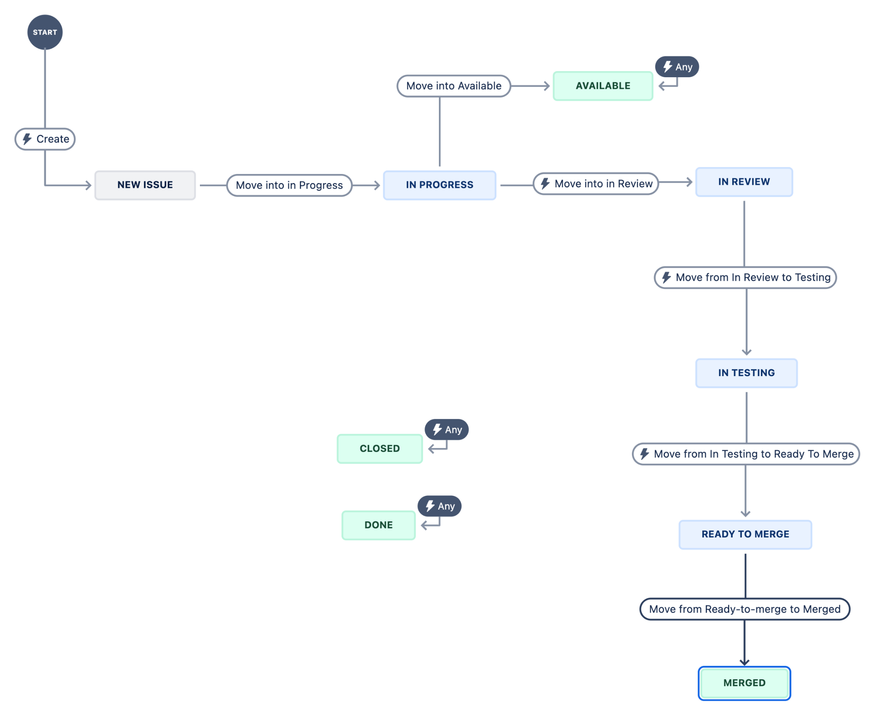
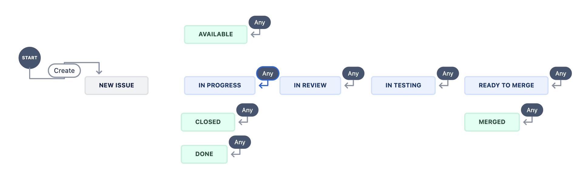

# Jira Issue Sync Script

This script automates the migration of issues from a source Jira project to a target Jira project using the REST API. It supports copying summary, description, issue type, components, and custom fields like Consortium Jira ID and Components.

## 🚀 Features

* Creates new issues in the target project based on source project data.
* Copies key fields like summary, description, priority, components, status, fix version, labels.
* Syncs custom fields (e.g., Consortium Jira ID, Components, Fix Version, Reporter Name).
* Logs API responses for troubleshooting.

---

## ⚙️ Prerequisites

1. **Jira Admin Permissions**

   * Admin access to the target Jira Project, view access to the source Jira Project.

2. **PHP + cURL**

   * Ensure PHP and the cURL extension are installed and enabled.

---
## Getting Started

Clone the repository, change into the root folder of the project, and install the dependencies.

```bash
git clone git@github.com:alfredamorrissey/atlassian-jira-migration.git
cd atlassian-jira-migration
composer install
```
---
## 🔐 Creating Your API Key

To authenticate with the Jira REST API, you’ll need to create a personal API token:

1. Go to [https://id.atlassian.com/manage/api-tokens](https://id.atlassian.com/manage/api-tokens).
2. Click **Create API token**.
3. Name your token (e.g., "Jira Sync Script") and click **Create**.
4. Copy the generated token. This is your only chance to view it.
5. In your script, use the token with your email address as Basic Auth:

```php
$headers = [
    'Authorization: Basic ' . base64_encode("you@example.com:your_api_token"),
    'Content-Type: application/json'
];
```

**Note:** Do not hard-code your token into version-controlled scripts. Use environment variables or configuration files excluded from git.

For documentation, see: [Atlassian API tokens](https://support.atlassian.com/atlassian-account/docs/manage-api-tokens-for-your-atlassian-account/)

---

## 🛠 Required Setup in Target Project

### 1. 🧹 Create Custom Fields

You must manually create the following custom fields in your **target Jira project**:

#### a. **Consortium Jira ID**

* **Type**: Text Field (single line)
* **Used for**: Storing the source issue key for reference.

#### b. **Components**

* **Type**: Labels
* **Used for**: Storing the names of the original components when the real `components` field is not available.

Once created, note down their **custom field IDs** (e.g., `customfield_12345`). You can find them by hitting the editmeta endpoint or using browser inspection tools.
https://{yourDomain}.atlassian.net/rest/api/3/issue/{issueKey}/editmeta

Update the .env file with your custom field values:

```php
CF_CONSORTIUM_JIRA_ISSUE=12385
CF_COMPONENTS=12419
CF_FIX_VERSION=12421
CF_REPORTER_NAME=12422
```

---

### 2. 🔄 Set Up Workflow (Optional but Recommended)

To fully match the source project’s issue handling process, configure your target project’s workflow:

* Map the source project’s statuses (e.g., "To Do", "In Progress", "Done") to your target project’s workflow.
* If statuses like "Available" or "Backlog" exist in the source, ensure those transitions and statuses are available in the target.
* Add any necessary screens or field configurations so fields like `components`, `priority`, or custom fields are editable via the API.

**Consortium Workflow Reference:**



#### Workflow States:

* New Issue
* In Progress
* Available
* In Review
* In Testing
* Ready to Merge
* Merged
* Done
* Closed

#### Example Transitions:

* New Issue → In Progress
* In Progress → In Review
* In Review → In Testing
* In Testing → Ready to Merge
* Ready to Merge → Merged
* Any → Available / Done / Closed

**New Project Workflow Reference:**



Note: In the new project, I allowed any status, to go to any status so that the script can move each issue to status of the original issue.

Note: Jira does not allow copying workflows directly via the API. You’ll need to manually replicate the workflow configuration or use Jira’s **shared workflow scheme** if applicable.

Documentation: [Jira Workflow Documentation](https://support.atlassian.com/jira-cloud-administration/docs/manage-your-workflows-in-jira-cloud/)

---

## 📄 How to Use

1. **Create your `.env` file**

   Copy the example environment file and customize it:

   ```bash
   cp .env.example .env
   ```


2. **Set required variables**

   Populate your .env with the following:

  * JIRA_SOURCE_DOMAIN and JIRA_TARGET_DOMAIN
  * JIRA_SOURCE_PROJECT and JIRA_TARGET_PROJECT
  * JIRA_API_TOKEN, JIRA_USER_EMAIL
  * Custom field mappings:
    ```dotenv
    CUSTOMFIELD_CONSORTIUM_ID=customfield_12345
    CUSTOMFIELD_COMPONENTS=customfield_12346
    ```

3. **Run the sync script**

    ```bash
    php import_consortium_jira.php [options]
    ```

---
## ✅ Available Options
| Option            | Description                                                            |
| ----------------- | ---------------------------------------------------------------------- |
| `--key`           | Comma-separated list of issue keys to sync (e.g., `--key SRC-1,SRC-2`) |
| `--start`         | Start index of issues to sync (inclusive)                              |
| `--end`           | End index of issues to sync (inclusive)                                |
| `--batches`       | Number of batches to process (each batch uses `--batch-size`)          |
| `--batch-size`    | Number of issues to process per batch (default: 10)                    |
| `--skip-existing` | Skip issues that already exist in the target project                   |

---
## 👇 Examples

**Sync specific issues by key:**

  ```bash
  php import_consortium_jira.php --key=ME-123,ME-234
  ```
**Sync a specific range of issues:**

  ```bash
  php import_consortium_jira.php --start=0 --end=100
  ```
**Sync in batches:**

  ```bash
  php import_consortium_jira.php --start=0 --batches=5 --batch-size=100
  ```
**Skip existing issues to speed up the sync:**

  ```bash
  php import_consortium_jira.php --start=0 --skip-existing
  ```  
  ---

## 🤪 Debugging and Testing in Postman

To test your Jira API calls manually:

1. Open [Postman](https://www.postman.com/).
2. Create a new request with method `GET` or `POST`.
3. Set the URL to your Jira REST endpoint, e.g.:

   * `https://your-domain.atlassian.net/rest/api/3/issue/ETCD-1/editmeta`
4. Under **Authorization**, choose `Basic Auth` and enter your email and API token.
5. Under **Headers**, set:

   * `Content-Type`: `application/json`
6. Add your JSON payload in the **Body** tab using `raw` format.
7. Click **Send** to test.

You can inspect responses and refine your request or payload format based on Jira's feedback.

Documentation:

* [Jira REST API reference](https://developer.atlassian.com/cloud/jira/platform/rest/v3/intro/)
* [Postman documentation](https://learning.postman.com/docs/getting-started/introduction/)

---

## 📋 Sample Response Logs

Jira Sync Log:

```log
Skipping media node: missing URL or filename. {"issueKey":"ME-8286","filename":null,"attachmentUrl":null,"mediaId":"8dfb0f6f-df64-4df5-8841-5b1c2ed7c72f","node":{...
Error processing issue: ME-8250 PUT request failed: HTTP code 404 {"method":"PUT","url":"https://uottawa.atlassian.net/rest/api/3/issue/ETCD-2063","httpCode":404,"response":{"errorMessages":["Error message."],"errors":[]}}
Falling back to text for comment: ETCD-2092 - POST request failed: HTTP code 400 {"method":"POST","url":"https://uottawa.atlassian.net/rest/api/3/issue/ETCD-2092/comment","httpCode":400,"response":{"errorMessages":["INVALID_INPUT"],"errors":[]}}

```

API Error (example):

```log
PUT request failed: HTTP code 404
https://uottawa.atlassian.net/rest/api/3/issue/ETCD-2063
Response: {"errors":{"components":"Field 'components' cannot be set. It is not on the appropriate screen, or unknown."}}

```

---

## ⚠️ Pain Points & Troubleshooting

### 🧩 Issue Type Mismatches & Relationships

- The **source project** (e.g., `ME`) often uses **non-standard issue types** or **custom configurations** (like “Epic,” “Story,” “Sub-task,” or renamed types).
- These types may not exist in the **target project**, causing 400-level errors on creation.
- To resolve this:
  - Use the `.env` file to **map or override issue types** explicitly.
  - Ensure any parent-child or epic links are valid for both source and target schemas.
  - Sub-task creation may require setting `parent` instead of using `issueLink`.

### 🧷 Parent/Child & Epic Links

- Relationships like "is parent of" or "is epic of" were failing when issue types didn’t support them.
- Validate the target project allows sub-tasks and epics.
- Use the `editmeta` API to confirm allowable fields/relations for the issue type.

### 🪵 ADF (Atlassian Document Format) Issues

- Major challenges were encountered sanitizing and submitting ADF (used in `description` and `comment` fields).
  - Nested structures sometimes exceeded Jira's parser limit.
  - Empty `attrs` fields (e.g., `[]`) in tables caused encoding failures. These had to be removed or replaced with `{}` (e.g., using `unset()` or casting to `new \stdClass()`).
  - Some rich text failed silently or caused partial syncs.
- Recommendation: use the `sanitizeADF()` and `flattenADF()` utilities, and log any failing payloads for later manual cleanup.

### 🧼 Inconsistent JSON Encoding

- Some fields (like attachments or deeply nested lists) broke due to PHP’s `json_encode()` producing arrays where Jira expects objects.
- Use `JSON_PRESERVE_ZERO_FRACTION` and validate your structure via Postman or curl before syncing at scale.

### ⏩ Skipping Already Synced Issues

- Use `--skip-existing` to avoid re-processing issues that already exist in the target.
- This is especially useful for testing or resuming interrupted syncs.

### 🧪 Hard-to-Detect Failures

- Errors like “Field cannot be set” may mean:
  - The field is not on the screen.
  - The field value is invalid in the target project context.
- Always check the `editmeta` endpoint (`GET /rest/api/3/issue/{issueKey}/editmeta`) to validate available fields for that issue type.

### 🧪 Troubleshooting tips

- Errors and warnings will be logged in logs/jira_synch.log
  - Falling back to text for comment: means the comment body couldn't be resolved with RTF so it will try to contain as much of the meaning in text format.
  - Skipping media node means, the original description/comment body had a file/media block in it, but no filename. The file couldn't be uploaded to link to.
  - Error processing issue means the issue was not updated/created in some way. Check the api_error log for more details.
-  The api_error.log will post the full url, method, response and payload of any failed PUT/POST methods
   - Copy the full payload and url to test in Postman
   - Click the Beautify button to put it in a more readable format and look for any possible errors that do not match the Atlassian Document Format (see below for documentation on syntax)
   - Try to minimize the payload until you target the issue
   - If possible, make an update to the code to handle any missed sanitization
   - Alternatively you can just make a list of the erroneaous issues and create them manually in your target project. 

* Jira API Reference: [Jira Cloud Platform REST API](https://developer.atlassian.com/cloud/jira/platform/rest/v3/intro/)
* Atlassian Document Format: [Atlassian Document Format](https://developer.atlassian.com/cloud/jira/platform/apis/document/structure/)

---

## ✅ Checklist

* [ ] API token created and added to env.
* [ ] Target project custom fields created.
* [ ] Workflow and screen configurations match source project.
* [ ] `$customFields` mapping updated in env.

---

## 📾 License

This script is provided "as is" under the MIT License. Feel free to modify and distribute.

---

